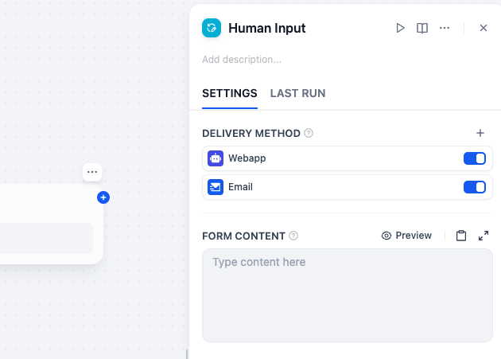
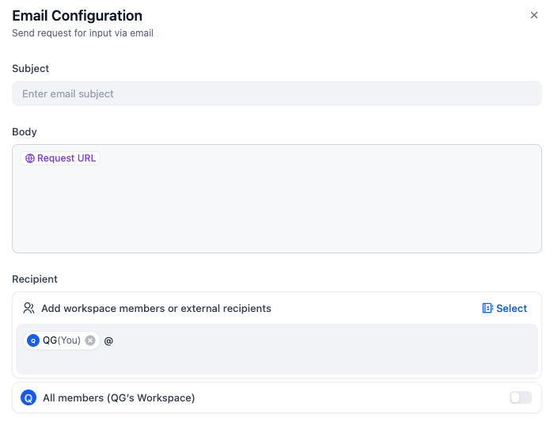
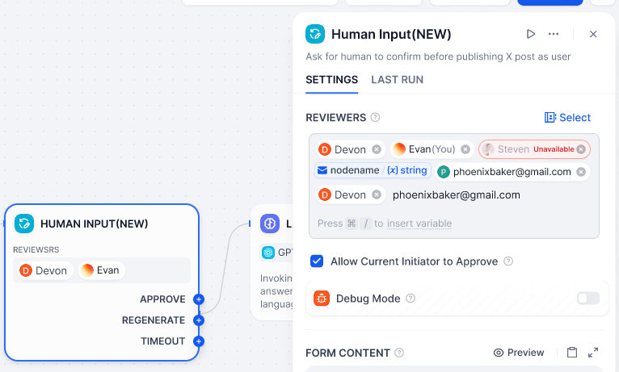
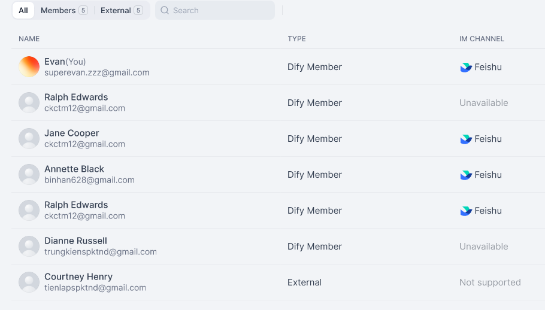

# Dify HITL 飞书 IM Demo

在飞书中无缝处理 Human Input 请求。

---

# IM 集成

## 企业用户天然工作在 IM 里，所以 HITL 需要在 IM 中找到人、触达人、服务人

- IM 渗透率高
- IM 送达更及时
- 在 IM 中处理阻力更小

<!-- IM 集成的价值，不只是多一个通知渠道，而是让 HITL 更自然地进入企业用户已经存在的工作场景。 -->

<!--
背景展开：

- 当前的 HITL 主要还是围绕 WebApp / 当前交互会话完成人工确认，这意味着任务很多时候停留在页面里等人回来处理。
- 从产品目标看，这次 IM 集成不是单纯增加一个通知渠道，而是增强 workflow 在人工确认场景下的主动触达能力。
- 对很多企业用户来说，IM 本来就是日常协作主入口，消息、审批、协同都先发生在 IM 里。
- 因此，如果 HITL 只能停留在 Dify 或 Web 页面中，任务很容易脱离用户的实际工作流。
- IM 的优势在于送达更及时，可以更快把待处理请求送到真正需要处理的人手里。
- 同时，如果用户能直接在 IM 中确认、审批，或者至少从 IM 中顺畅跳转处理，整个体验会更贴近日常协作方式，也更容易被真实业务接受。
-->

---
layout: section
---

# 现场演示流程

---

# 接下来要做什么

---

## 以接收者为中心的配置

  

    
  

  

    
  

---
layout: section
---

  

    
  

  

    
  

---

# 更多

  

    <h3>更多 IM 集成</h3>
    
从飞书出发，继续扩展到更多 IM 渠道，而不是停留在单一接入。

  

  

    <h3>不同形态接入</h3>
    
补全 CE、EE、SaaS 不同部署形态下的接入方式和产品边界。

  

  

    <h3>联系人管理能力</h3>
    
补全 Contact 和 Human Roster 的管理能力，让通知对象管理更完整。

  

---
layout: center
class: text-center
---

# Q&A
